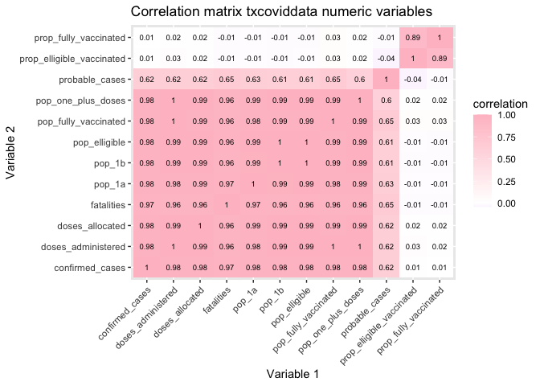
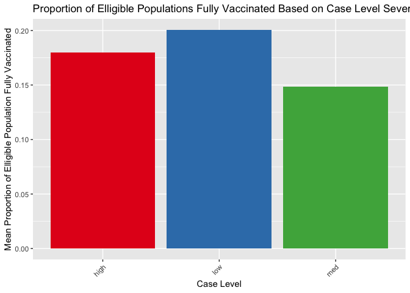
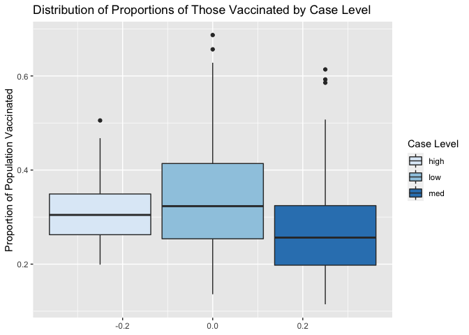
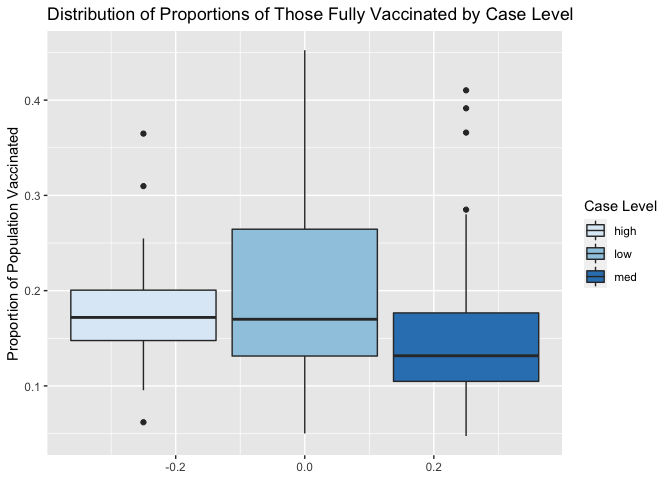

Using Modeling to Analyze Covid-19 Data in Counties Across Texas
================
Ashley Gilliam
4/12/2021

## Introduction

In this project, I will be analyzing the relationships between various
data collected over the course of the SARS-CoV-2 pandemic in counties
across Texas using regression modeling, hypothesis testing, and ANOVA.
The dataset I will be using is called txcoviddata. It is a combination
of a dataset containing information on Covid-19 cases and fatalities as
well as vaccination data across Texas counties from 3/10/2021. The data
was collected by the Texas Department of Health and Human Services as
reported by healthcare centers across the state. I previously joined and
tidied the data in my first project. The dataset consists of the county
name, the number of confirmed covid cases within that county, the
probable covid cases, and the fatalities. There’s also a count of the
total vaccine doses allocated to that county, the number of vaccines
doses administered of those allocated, the population count that had
received at least one dose, and the population count that had been fully
vaccinated. The total population elligible under Phase 1a (essential
healthcare employees) and the total population elligible under Phase 1b
(those 65+ and 16-65 with at least one chronic health condition) are
also included and summed in the total elligible population variable. I
also calculated and included the proportion of the elligible population
that had been vaccinated, and the case level, a categorical variable
formed based on how many cases each county had. Those with less than
1000 cases were placed in the “low” group, those with over 10,000 cases
were placed in the “high” group, and any counties in between are in the
“medium” group. In total there are 254 observations, representative of
the 254 counties in Texas. I am particularly interested in studying this
data because it is important to our current lives. We are in a pandemic
that we are currently fighting against with the power of vaccinations.
It is fascinating to study how our state’s infrastructure has been able
to tackle this battle, and analyze any common patterns demonstrable in
the data presented to us.

## EDA

The first thing I will be doing is performing a brief exploratory data
analysis of my dataset. I created a correlation matrix to see how each
of the variables relates to one another. Surprisingly, the vast majority
of the variables have a very high, positive correlation between each
other. The proportion variables I had created do not have a demonstrable
relationship between any of the other variables. None of the variables
listed have a negative correlation between each other. I then calculated
the mean proportions of those that had been fully vaccinated based on
case level as well as visualized the data with a bar graph. The case
levels had relatively close mean proportions with the low group having
the highest mean and the medium group having the lowest. This could be
explained by the fact that those in the low case level category have
less total population that they need to vaccinate, meaning that they can
inoculate at a faster rate. However, those counties in the small case
level group may also have less resources, which could indicate why they
aren’t too much ahead of the other case level groups.

``` r
library(readxl)
library(tidyverse)
```

    ## ── Attaching packages ─────────────────────────────────────── tidyverse 1.3.0 ──

    ## ✓ ggplot2 3.3.3     ✓ purrr   0.3.4
    ## ✓ tibble  3.0.5     ✓ dplyr   1.0.3
    ## ✓ tidyr   1.1.2     ✓ stringr 1.4.0
    ## ✓ readr   1.4.0     ✓ forcats 0.5.0

    ## ── Conflicts ────────────────────────────────────────── tidyverse_conflicts() ──
    ## x dplyr::filter() masks stats::filter()
    ## x dplyr::lag()    masks stats::lag()

``` r
#import dataset
txcoviddata <- read_csv("txcoviddata.csv") %>%
  mutate("prop_fully_vaccinated" = (pop_fully_vaccinated/pop_elligible))
```

    ## 
    ## ── Column specification ────────────────────────────────────────────────────────
    ## cols(
    ##   county = col_character(),
    ##   confirmed_cases = col_double(),
    ##   probable_cases = col_double(),
    ##   fatalities = col_double(),
    ##   doses_allocated = col_double(),
    ##   doses_administered = col_double(),
    ##   pop_one_plus_doses = col_double(),
    ##   pop_fully_vaccinated = col_double(),
    ##   pop_1a = col_double(),
    ##   pop_1b = col_double(),
    ##   pop_elligible = col_double(),
    ##   prop_elligible_vaccinated = col_double(),
    ##   case_level = col_character()
    ## )

``` r
txcoviddata_num <- txcoviddata %>%
  select(-c("county", "case_level"))

#visualize the correlation matrix usiing a heatmap
cor(txcoviddata_num, use = "pairwise.complete.obs") %>%
  #save as a data frame
  as.data.frame %>%
  #convert row names to an explicit variable
  rownames_to_column %>%
  #pivot so that all correlations appear in the same column
  pivot_longer(-1, names_to = "other_var", values_to = "correlation") %>%
  ggplot(aes(rowname, other_var, fill=correlation)) +
  #heatmap with geom_tile
  geom_tile() +
  #apply color gradient for scale
  scale_fill_gradient2(low="purple",mid="white",high="pink") +
  #overlay values
  geom_text(aes(label = round(correlation,2)), color = "black", size = 2.5) +
  #add title and axis labels
  labs(title = "Correlation matrix txcoviddata numeric variables", x = "Variable 1", y = "Variable 2") +
  #rotate x-axis variables at an angle so they are easier to read
  theme(axis.text.x = element_text(angle=45, hjust=1)) 
```

<!-- -->

``` r
txcoviddata %>%
   #make plot for proportion of those fully vaccinated vs. case level colored by case level
  ggplot(aes(x=case_level, y=prop_fully_vaccinated, fill=case_level)) +
  #create a bargraph
  geom_bar(stat="summary", fun="mean") +  
  #change colors of bars
  scale_fill_brewer(palette="Set1") +
  #remove legend
  theme(axis.text.x = element_text(angle=45, hjust=1), legend.position="none") +
  #add axis labels and graph title
  labs(x= "Case Level", y= "Mean Proportion of Elligible Population Fully Vaccinated", title = "Proportion of Elligible Populations Fully Vaccinated Based on Case Level Severity") 
```

<!-- -->

``` r
#create summary statistics
txcoviddata %>%
  group_by(case_level) %>%
  summarize(mean=mean(prop_elligible_vaccinated))
```

    ## # A tibble: 3 x 2
    ##   case_level  mean
    ## * <chr>      <dbl>
    ## 1 high       0.315
    ## 2 low        0.342
    ## 3 med        0.273

## MANOVA

I will be using a MANOVA to analyze if the proportion of elligible
people who have received at least one dose and the proportion of
eligible population that are fully vaccinated differ across case level.
I first tested the assumptions in order to determine if a MANOVA would
be fitting to use. The Shapiro-Wilke test was used to test if the
proportions were normally distributed across case levels. The null
hypothesis is that the distributions are normally distributed while the
alternative hypothesis is that the distributions are not normally
distributed. The tests were performed and the p-values given were all
less than alpha, 0.05, indicating that the assumptions were all
non-normal. The next assumption I tested was equal variance by
calculating using the Fligner-Killeen test. This test is more robust
against non-normal distributions. The null hypothesis is that there are
equal variances between groups and within groups, and the alternative
hypothesis is that the variances are unequal. The p-values given for
both tests, 0.005 and 0.002, are both less than the alpha value of 0.05,
so we reject the null hypothesis and conclude that the variances are
unequal. The null hypothesis of a MANOVA is that the mean proportion of
eligible population that has received at least one vaccine dose and the
mean proportion of eligible population that has been fully vaccinated (2
doses) is equal across all case level groups. The alternative hypothesis
is that for at least the proportion of eligible population that has
received at least one vaccine dose or the mean proportion of eligible
population fully vaccinated, at least one of the group means differs.
The MANOVA was run and a p-value of 7.43x10^-5 was given, meaning that
we would reject the null hypothesis and accept the alternative
hypothesis. Since we accepted the alternative hypothesis, I will run
individual ANOVAs to see which of the two proportions’ means are
significantly different across case levels. Since the normality and
equal variance assumptions were violated, I thought it would be best to
conduct a PERMANOVA test in addition to the MANOVA. A PERMANOVA involves
a randomization test along with a MANOVA and means that we can analyze
significance even if each of our assumptions are not met. The null
hypothesis is that the centroids are equivalent across all groups, while
the alternative hypothesis is that the centroids are not equivalent
across all groups. A PERMANOVA test was run and a p-value of 0.001 was
given, indicating that we reject the null hypothesis and conclude that
the centroids are not equivalent across all groups. This further
confirms that I can run the individual ANOVAs for the two proportion
variables. The individual ANOVAs were run and the p-values were both
less than the alpha value of 0.05, indicating that we would reject the
null hypothesis that at least one of the mean proportions differs from
the other case levels. In order to determine which one significantly
differs, I will run post-hoc t-test analyses for both variables across
each case level group. Since I have run 10 hypothesis tests total (6
post-hoc t-tests, 2 ANOVAs, 1 MANOVA, and 1 PERMANOVA), I will calculate
my Bonferroni corrected alpha level by dividing 0.05/10 to acquire an
alpha prime value of 0.005. Using this value to interpret my post-hoc
tests, I can conclude that, given the p-values of 1.4x10^-6 and
1.7x10^-6, both the mean proportion of eligible population fully
vaccinated and the mean proportion of eligible population that has
received at least one dose differs significantly between the case level
groups medium and low.

``` r
#the first thing I will do is check my assumptions for the MANOVA
# Check assumptions for proportions visually
ggplot(txcoviddata, aes(y = prop_elligible_vaccinated)) +
  geom_boxplot(aes(fill = as.factor(case_level))) +
  scale_fill_brewer() +
  labs(y="Proportion of Population Vaccinated", title="Distribution of Proportions of Those Vaccinated by Case Level", fill="Case Level")
```

<!-- -->

``` r
ggplot(txcoviddata, aes(y = prop_fully_vaccinated)) +
  geom_boxplot(aes(fill = as.factor(case_level))) +
  scale_fill_brewer() +
    labs(y="Proportion of Population Vaccinated", title="Distribution of Proportions of Those Fully Vaccinated by Case Level", fill="Case Level")
```

<!-- -->

``` r
#check for normality
txcoviddata %>%
  group_by(case_level) %>%
  summarize(p.value = shapiro.test(prop_elligible_vaccinated)$p.value)
```

    ## # A tibble: 3 x 2
    ##   case_level    p.value
    ## * <chr>           <dbl>
    ## 1 high       0.191     
    ## 2 low        0.00498   
    ## 3 med        0.00000361

``` r
txcoviddata %>%
  group_by(case_level) %>%
  summarize(p.value = shapiro.test(prop_fully_vaccinated)$p.value)
```

    ## # A tibble: 3 x 2
    ##   case_level      p.value
    ## * <chr>             <dbl>
    ## 1 high       0.0352      
    ## 2 low        0.00000434  
    ## 3 med        0.0000000204

``` r
#check for equal variance
fligner.test(prop_elligible_vaccinated ~ case_level, data = txcoviddata)
```

    ## 
    ##  Fligner-Killeen test of homogeneity of variances
    ## 
    ## data:  prop_elligible_vaccinated by case_level
    ## Fligner-Killeen:med chi-squared = 10.544, df = 2, p-value = 0.005132

``` r
fligner.test(prop_fully_vaccinated ~ case_level, data = txcoviddata)
```

    ## 
    ##  Fligner-Killeen test of homogeneity of variances
    ## 
    ## data:  prop_fully_vaccinated by case_level
    ## Fligner-Killeen:med chi-squared = 11.953, df = 2, p-value = 0.002537

``` r
#Perform individual ANOVAS
#perform MANOVA with prop_elligible_vaccinated and prop_fully_vaccinated across case level
manova_txcovid <- manova(cbind(prop_elligible_vaccinated,prop_fully_vaccinated) ~ case_level, data = txcoviddata)

#view output of MANOVA
summary(manova_txcovid)
```

    ##             Df   Pillai approx F num Df den Df    Pr(>F)    
    ## case_level   2 0.093783   6.1744      4    502 7.429e-05 ***
    ## Residuals  251                                              
    ## ---
    ## Signif. codes:  0 '***' 0.001 '**' 0.01 '*' 0.05 '.' 0.1 ' ' 1

``` r
#perform individual ANOVAS for the two proportions across case level
summary.aov(manova_txcovid)
```

    ##  Response prop_elligible_vaccinated :
    ##              Df  Sum Sq  Mean Sq F value    Pr(>F)    
    ## case_level    2 0.26109 0.130544  12.288 8.103e-06 ***
    ## Residuals   251 2.66647 0.010623                      
    ## ---
    ## Signif. codes:  0 '***' 0.001 '**' 0.01 '*' 0.05 '.' 0.1 ' ' 1
    ## 
    ##  Response prop_fully_vaccinated :
    ##              Df  Sum Sq  Mean Sq F value    Pr(>F)    
    ## case_level    2 0.15051 0.075255  12.042 1.014e-05 ***
    ## Residuals   251 1.56860 0.006249                      
    ## ---
    ## Signif. codes:  0 '***' 0.001 '**' 0.01 '*' 0.05 '.' 0.1 ' ' 1

``` r
#run PERMANOVA 
library(vegan)
```

    ## Loading required package: permute

    ## Loading required package: lattice

    ## This is vegan 2.5-7

``` r
# Compute Euclidean distances between observations
dists <- txcoviddata %>%
  select(prop_elligible_vaccinated, prop_fully_vaccinated) %>%
  dist

# Perform PERMANOVA on the distance matrix
permanova_txcovid <- adonis(dists ~ case_level, data = txcoviddata)

    # If ANOVA is significant then we can perform post-hoc analysis
    # For proportion of eligible population receiving at least one dose
    pairwise.t.test(txcoviddata$prop_elligible_vaccinated,txcoviddata$case_level, p.adj="none")
```

    ## 
    ##  Pairwise comparisons using t tests with pooled SD 
    ## 
    ## data:  txcoviddata$prop_elligible_vaccinated and txcoviddata$case_level 
    ## 
    ##     high  low    
    ## low 0.172 -      
    ## med 0.039 1.4e-06
    ## 
    ## P value adjustment method: none

``` r
    # For proportion of eligible population fully vaccinated
    pairwise.t.test(txcoviddata$prop_fully_vaccinated,txcoviddata$case_level, p.adj="none")
```

    ## 
    ##  Pairwise comparisons using t tests with pooled SD 
    ## 
    ## data:  txcoviddata$prop_fully_vaccinated and txcoviddata$case_level 
    ## 
    ##     high  low    
    ## low 0.173 -      
    ## med 0.042 1.7e-06
    ## 
    ## P value adjustment method: none

## Randomization Test

Since the normality and equal variance assumptions were violated in my
distributions, I thought it would be best to perform a randomization
test to see if the mean proportion of eligible population fully
vaccinated is truly significantly different between the low and medium
case levels. The null hypothesis is that the average proportions of
eligible population fully vaccinated are equal between the low and
medium case level groups, and the alternative hypothesis is that the
average proportion of eligible population fully vaccinated of the low
case group is significantly different from the average proportion of
eligible population fully vaccinated of the medium case group. First the
mean difference of proportions between the medium and low case level was
calculated. Then, a randomization was performed 1000 that shuffled the
proportions between the case levels so that there was no longer any
systematic association between the proportions and case level. I then
grouped by case level and calculated the mean difference in proportions
between low and medium case levels with this scrambled dataset. The
randomized mean differences, my null sampling distribution, was
visualized using a histogram. A fairly normal distribution is indicated.
I then calculated the proportion of of the randomized mean differences
that were greater than the absolute value of my originally observed mean
difference to get my p-value. The calculated p-value came out to be 1,
meaning I fail to reject the null hypothesis that the mean proportions
of eligible population fully vaccinated are equal between the low and
medium case level groups. This contrasts from my results in the previous
section that the mean proportions of the two case level groups are
significantly different. This could be explained by the fact that the
assumptions were violated, so the ANOVA tests were not wholly
accurate.

``` r
#create dataset that filters for only the medium and low case level groups
txcoviddata_ml <- txcoviddata %>%
  filter(case_level=="low" | case_level=="med")


#create mean difference between proportions of low and medium case levels
obs_diff <- txcoviddata_ml %>% 
  group_by(case_level) %>%
  summarize(means = mean(prop_fully_vaccinated)) %>%
  summarize(obs_diff = diff(means)) %>%
  pull

set.seed(123)
diff_means_random <- vector()

for(i in 1:1000){
  temp <- txcoviddata_ml %>% 
    mutate(prop_fully_vaccinated = sample(prop_fully_vaccinated))
  
  diff_means_random[i] <- temp %>% 
    group_by(case_level) %>%
    summarize(means = mean(prop_fully_vaccinated)) %>%
    summarize(diff_means_random = -diff(means)) %>%
    pull
}

hist(diff_means_random, main="Histogram of Randomized Mean Differences", col="Pink")
```

<!-- -->

``` r
sum(abs(diff_means_random)>obs_diff)/length(diff_means_random)
```

    ## [1] 1

## Linear Regression

I used a linear regression model to predict the relationship between the
total number of doses administered and total doses allocated and the
total eligible population. I first centered the two explanatory
variables and thene fit a regression model with an interaction term.
Based on the model, for every increase in doses allocated by 1 vaccine,
the total number of doses administered increases by 0.272. For every
increase in eligible population by 1 person, the total number of doses
administered increases by 0.327. My model explains 99.14% of the
variation in the response variable. I checked the assumptions of
linearity, normality, and homoscedasticity. A Q-Q plot was constructeed
to analyze the linearity. Since many of the observations do not fall
along the line, I can conclude that the model is nonlinear. The
Shapiro-Wilke test for normality returned a p-value of 2.2e-16,
indicating that we reject the null hypothesis that the distribution is
normal and conclude that it is not normal. Finally, the Breusch-Pagan
test was conducted to check for homoscedasticity. A p-value of 1.61e-10
was given, meaning that I rejct the null hypothesis that there is
homoscedasticity and conclude that there is not any. I then computed the
regression again, this time with robust standard errors. Compared to the
original regression model, the interaction term between vaccine doses
allocated and total eligible population is no longer significant. The
coefficient values are the same, but the standard error values have
increased. Lastly, I computed bootstrapped standard errors. The
bootstrapped standard errors are lower than both the original standard
error values and the robust standard errors. When the robust standard
errors were calculated and the values were larger, the p-values
increased as well. Thus, the p-values for the bootstrapped standard
errors are likely lower than the other two
regressions.

``` r
# Center the data around the means (the intercept becomes more informative)
txcoviddata$doses_allocated_c <- txcoviddata$doses_allocated - mean(txcoviddata$doses_allocated)
txcoviddata$pop_elligible_c <- txcoviddata$pop_elligible - mean(txcoviddata$pop_elligible)

# Fit a regression model with centered predictors including interaction term
fit_c <- lm(doses_administered ~ doses_allocated_c * pop_elligible_c, data = txcoviddata)
summary(fit_c)
```

    ## 
    ## Call:
    ## lm(formula = doses_administered ~ doses_allocated_c * pop_elligible_c, 
    ##     data = txcoviddata)
    ## 
    ## Residuals:
    ##    Min     1Q Median     3Q    Max 
    ## -26955  -1274    265    737  80356 
    ## 
    ## Coefficients:
    ##                                     Estimate Std. Error t value Pr(>|t|)    
    ## (Intercept)                        2.774e+04  5.748e+02  48.266  < 2e-16 ***
    ## doses_allocated_c                  2.724e-01  4.053e-02   6.721 1.22e-10 ***
    ## pop_elligible_c                    3.274e-01  2.932e-02  11.167  < 2e-16 ***
    ## doses_allocated_c:pop_elligible_c -3.311e-08  6.670e-09  -4.963 1.28e-06 ***
    ## ---
    ## Signif. codes:  0 '***' 0.001 '**' 0.01 '*' 0.05 '.' 0.1 ' ' 1
    ## 
    ## Residual standard error: 8753 on 250 degrees of freedom
    ## Multiple R-squared:  0.9915, Adjusted R-squared:  0.9914 
    ## F-statistic:  9698 on 3 and 250 DF,  p-value: < 2.2e-16

``` r
# Visualize the relationships between the three variables
ggplot(txcoviddata, aes(x = doses_allocated, y = doses_administered, color = pop_elligible)) +
  #add regression line
  geom_smooth(method=lm, se=FALSE, fullrange=TRUE, color="black") +
  #create scatterplot
  geom_point() +
  #change gradient colors
  scale_color_gradient(low="purple", high="pink") +
  #add axes, title, and legend labels
  labs(x="Doses Allocated", y="Doses Administered", title="Doses Administered by Doses Allocated and Eligible Population", color="Eligible Population")
```

    ## `geom_smooth()` using formula 'y ~ x'

<!-- -->

``` r
#Checking Assumptions

#Check for linearity
# Q-Q plot for the residuals
plot(fit_c, which = 2)
```

<!-- -->

``` r
#does not appear linear

#Check for normality
# Shapiro-Wilk test
# H0: normality
shapiro.test(fit_c$residuals)
```

    ## 
    ##  Shapiro-Wilk normality test
    ## 
    ## data:  fit_c$residuals
    ## W = 0.52469, p-value < 2.2e-16

``` r
library(sandwich);
# Install a new package
# install.packages("lmtest")
library(lmtest)
```

    ## Loading required package: zoo

    ## 
    ## Attaching package: 'zoo'

    ## The following objects are masked from 'package:base':
    ## 
    ##     as.Date, as.Date.numeric

``` r
#Check for homoscedasticity
# Breusch-Pagan test
# H0: homoscedasticity
bptest(fit_c) 
```

    ## 
    ##  studentized Breusch-Pagan test
    ## 
    ## data:  fit_c
    ## BP = 48.572, df = 3, p-value = 1.609e-10

``` r
#reject H0

# calculate robust standard errors
coeftest(fit_c, vcov = vcovHC(fit_c))
```

    ## 
    ## t test of coefficients:
    ## 
    ##                                      Estimate  Std. Error t value  Pr(>|t|)    
    ## (Intercept)                        2.7744e+04  1.4410e+03 19.2531 < 2.2e-16 ***
    ## doses_allocated_c                  2.7238e-01  9.2786e-02  2.9356  0.003639 ** 
    ## pop_elligible_c                    3.2741e-01  5.5236e-02  5.9274 1.016e-08 ***
    ## doses_allocated_c:pop_elligible_c -3.3108e-08  6.8240e-08 -0.4852  0.627980    
    ## ---
    ## Signif. codes:  0 '***' 0.001 '**' 0.01 '*' 0.05 '.' 0.1 ' ' 1

``` r
#bootstrap standard errors
samp_SEs <- replicate(5000, {
  # Bootstrap your data (resample observations)
  boot_data <- sample_frac(txcoviddata, replace = TRUE)
  # Fit regression model
  fitboot <- lm(doses_administered ~ doses_allocated_c * pop_elligible_c, data = boot_data)
  # Save the coefficients
  coef(fitboot)
})

# estimated SEs
samp_SEs %>%
  # Transpose the obtained matrices
  t %>%
  # Consider the matrix as a data frame
  as.data.frame %>%
  # Compute the standard error (standard deviation of the sampling distribution)
  summarize_all(sd)
```

    ##   (Intercept) doses_allocated_c pop_elligible_c
    ## 1    1272.801         0.1013395       0.0630332
    ##   doses_allocated_c:pop_elligible_c
    ## 1                      6.873985e-08

## Logistic Regression

To conduct a logistic regression, I first dummy-coded my case level
variable, called y, so that any high case level counties were 1 and low
or medium case level counties were grouped as 0. I then ran a regression
model predicting y from the proportion of those fully vaccinated and
total confirmed fatalities. Every one-unit increase in proportion of
those fully vaccinated increases the log odds of being placed in the
high case level category by 0.677 and multiplies the log odds of being
in the high case level by 1.969. Every one-unit increase in fatalities
by one death increases the log odds of being placed in the high case
level category by 0.023 and multiplies the odds of being placed in the
high case level category by 1.02. A confusion matrix was created from my
model. The accuracy was 0.957, the sensitivity was 0.829, the
specificity was 0.977, and the recall was 0.853. Overall, my logistic
model was fairly accurate in predicting case level based on the
proportion of those fully vaccinated and how many fatalities were
reported in the county. A density plot was also made to visualize the
log-odds by the binary variable I had created. Finally, I created a ROC
curve and calculated the AUC. The calculated AUC value came out to be
0.991.The value is very high, indicating that the logistic regression
model has a very strong predictive power for case level. This means that
a randomly selected county from the positive group has a test value
larger than for a randomly chosen county from the negative group 99.1%
of the time.

``` r
# Create a binary variable coded as 0 and 1
txcoviddata <- txcoviddata %>%
  mutate(y = ifelse(case_level == "high", 1, 0))

# Let's look at the definion of odds = p/(1-p)
odds <- function(p)p/(1-p)

# Simulate probability values (varying between 0 and 1 by 0.1)
p <-seq(0, 1, by = .1)

# Create a dataframe with these probabilities and corresponding odds
cbind(p, odds = odds(p)) %>%
  round(4) %>%
  as.data.frame
```

    ##      p   odds
    ## 1  0.0 0.0000
    ## 2  0.1 0.1111
    ## 3  0.2 0.2500
    ## 4  0.3 0.4286
    ## 5  0.4 0.6667
    ## 6  0.5 1.0000
    ## 7  0.6 1.5000
    ## 8  0.7 2.3333
    ## 9  0.8 4.0000
    ## 10 0.9 9.0000
    ## 11 1.0    Inf

``` r
#define logit function
logit <- function(p) log(odds(p))
cbind(p, odds = odds(p), logit = logit(p)) %>% 
  round(4) %>%
  as.data.frame
```

    ##      p   odds   logit
    ## 1  0.0 0.0000    -Inf
    ## 2  0.1 0.1111 -2.1972
    ## 3  0.2 0.2500 -1.3863
    ## 4  0.3 0.4286 -0.8473
    ## 5  0.4 0.6667 -0.4055
    ## 6  0.5 1.0000  0.0000
    ## 7  0.6 1.5000  0.4055
    ## 8  0.7 2.3333  0.8473
    ## 9  0.8 4.0000  1.3863
    ## 10 0.9 9.0000  2.1972
    ## 11 1.0    Inf     Inf

``` r
#make logistic regression model
fit_log <- glm(y ~ prop_fully_vaccinated + fatalities, data = txcoviddata, family = binomial(link="logit"))
```

    ## Warning: glm.fit: fitted probabilities numerically 0 or 1 occurred

``` r
summary(fit_log)
```

    ## 
    ## Call:
    ## glm(formula = y ~ prop_fully_vaccinated + fatalities, family = binomial(link = "logit"), 
    ##     data = txcoviddata)
    ## 
    ## Deviance Residuals: 
    ##      Min        1Q    Median        3Q       Max  
    ## -2.28595  -0.13614  -0.09013  -0.07277   2.21704  
    ## 
    ## Coefficients:
    ##                        Estimate Std. Error z value Pr(>|z|)    
    ## (Intercept)           -6.265687   1.319504  -4.749 2.05e-06 ***
    ## prop_fully_vaccinated  0.677624   6.006408   0.113     0.91    
    ## fatalities             0.022751   0.003818   5.959 2.54e-09 ***
    ## ---
    ## Signif. codes:  0 '***' 0.001 '**' 0.01 '*' 0.05 '.' 0.1 ' ' 1
    ## 
    ## (Dispersion parameter for binomial family taken to be 1)
    ## 
    ##     Null deviance: 203.678  on 253  degrees of freedom
    ## Residual deviance:  47.106  on 251  degrees of freedom
    ## AIC: 53.106
    ## 
    ## Number of Fisher Scoring iterations: 9

``` r
# Interpret the coefficients by considering the odds (inverse of log(odds))
exp(coef(fit_log))
```

    ##           (Intercept) prop_fully_vaccinated            fatalities 
    ##           0.001900408           1.969193423           1.023012027

``` r
#make confusion matrix
txcoviddata$prob1 <- predict(fit_log, type = "response")
txcoviddata$predicted <- ifelse(txcoviddata$prob1 > .5, "high", "medium and low")
table(true_condition = txcoviddata$case_level, predicted_condition = txcoviddata$predicted) %>% 
  addmargins
```

    ##               predicted_condition
    ## true_condition high medium and low Sum
    ##           high   29              6  35
    ##           low     0            112 112
    ##           med     5            102 107
    ##           Sum    34            220 254

``` r
#Accuracy
(29+112+102)/254
```

    ## [1] 0.9566929

``` r
#Sensitivity (TPR)
(29/35)
```

    ## [1] 0.8285714

``` r
#Specificity (TNR)
(112+102)/(112+107)
```

    ## [1] 0.9771689

``` r
#Recall (PPV)
(29/34)
```

    ## [1] 0.8529412

``` r
#create density plot
txcoviddata$logit <- predict(fit_log)
txcoviddata %>%
  ggplot() + 
  geom_density(aes(logit, color = case_level, fill = case_level), alpha = .4) +
    geom_rug(aes(logit, color = case_level)) +
  xlab("logit (log-odds)") +
  labs(title="Density Plot for Log-Odds by y")
```

<!-- -->

``` r
#create ROC curve
library(plotROC) 
#save predicted probabilities and corresponding true outcome
df <- data.frame(
  prob = predict(fit_log, type = "response"),
  y = txcoviddata$y)

# ROC curve
ROCplot <- ggplot(df) + geom_roc(aes(d = y, m = prob), n.cuts = 0)
ROCplot
```

<!-- -->

``` r
# AUC
AUC <- calc_auc(ROCplot)$AUC
AUC
```

    ## [1] 0.990998

## References

<div id="refs" class="references">

<div id="ref-R-purrr">

Henry, Lionel, and Hadley Wickham. 2020. *Purrr: Functional Programming
Tools*. <https://CRAN.R-project.org/package=purrr>.

</div>

<div id="ref-R-lmtest">

Hothorn, Torsten, Achim Zeileis, Richard W. Farebrother, and Clint
Cummins. 2020. *Lmtest: Testing Linear Regression Models*.
<https://CRAN.R-project.org/package=lmtest>.

</div>

<div id="ref-R-tibble">

Müller, Kirill, and Hadley Wickham. 2021. *Tibble: Simple Data Frames*.
<https://CRAN.R-project.org/package=tibble>.

</div>

<div id="ref-R-vegan">

Oksanen, Jari, F. Guillaume Blanchet, Michael Friendly, Roeland Kindt,
Pierre Legendre, Dan McGlinn, Peter R. Minchin, et al. 2020. *Vegan:
Community Ecology Package*. <https://CRAN.R-project.org/package=vegan>.

</div>

<div id="ref-R-base">

R Core Team. 2020. *R: A Language and Environment for Statistical
Computing*. Vienna, Austria: R Foundation for Statistical Computing.
<https://www.R-project.org/>.

</div>

<div id="ref-plotROC2017">

Sachs, Michael C. 2017. “plotROC: A Tool for Plotting Roc Curves.”
*Journal of Statistical Software, Code Snippets* 79 (2): 1–19.
<https://doi.org/10.18637/jss.v079.c02>.

</div>

<div id="ref-R-plotROC">

———. 2018. *PlotROC: Generate Useful Roc Curve Charts for Print and
Interactive Use*. <http://sachsmc.github.io/plotROC>.

</div>

<div id="ref-lattice2008">

Sarkar, Deepayan. 2008. *Lattice: Multivariate Data Visualization with
R*. New York: Springer. <http://lmdvr.r-forge.r-project.org>.

</div>

<div id="ref-R-lattice">

———. 2020. *Lattice: Trellis Graphics for R*.
<http://lattice.r-forge.r-project.org/>.

</div>

<div id="ref-R-permute">

Simpson, Gavin L. 2019. *Permute: Functions for Generating Restricted
Permutations of Data*. <https://github.com/gavinsimpson/permute>.

</div>

<div id="ref-ggplot22016">

Wickham, Hadley. 2016. *Ggplot2: Elegant Graphics for Data Analysis*.
Springer-Verlag New York. <https://ggplot2.tidyverse.org>.

</div>

<div id="ref-R-stringr">

———. 2019a. *Stringr: Simple, Consistent Wrappers for Common String
Operations*. <https://CRAN.R-project.org/package=stringr>.

</div>

<div id="ref-R-tidyverse">

———. 2019b. *Tidyverse: Easily Install and Load the Tidyverse*.
<https://CRAN.R-project.org/package=tidyverse>.

</div>

<div id="ref-R-forcats">

———. 2020a. *Forcats: Tools for Working with Categorical Variables
(Factors)*. <https://CRAN.R-project.org/package=forcats>.

</div>

<div id="ref-R-tidyr">

———. 2020b. *Tidyr: Tidy Messy Data*.
<https://CRAN.R-project.org/package=tidyr>.

</div>

<div id="ref-tidyverse2019">

Wickham, Hadley, Mara Averick, Jennifer Bryan, Winston Chang, Lucy
D’Agostino McGowan, Romain François, Garrett Grolemund, et al. 2019.
“Welcome to the tidyverse.” *Journal of Open Source Software* 4 (43):
1686. <https://doi.org/10.21105/joss.01686>.

</div>

<div id="ref-R-readxl">

Wickham, Hadley, and Jennifer Bryan. 2019. *Readxl: Read Excel Files*.
<https://CRAN.R-project.org/package=readxl>.

</div>

<div id="ref-R-ggplot2">

Wickham, Hadley, Winston Chang, Lionel Henry, Thomas Lin Pedersen,
Kohske Takahashi, Claus Wilke, Kara Woo, Hiroaki Yutani, and Dewey
Dunnington. 2020. *Ggplot2: Create Elegant Data Visualisations Using the
Grammar of Graphics*. <https://CRAN.R-project.org/package=ggplot2>.

</div>

<div id="ref-R-dplyr">

Wickham, Hadley, Romain François, Lionel Henry, and Kirill Müller. 2021.
*Dplyr: A Grammar of Data Manipulation*.
<https://CRAN.R-project.org/package=dplyr>.

</div>

<div id="ref-R-readr">

Wickham, Hadley, and Jim Hester. 2020. *Readr: Read Rectangular Text
Data*. <https://CRAN.R-project.org/package=readr>.

</div>

<div id="ref-sandwich2004">

Zeileis, Achim. 2004. “Econometric Computing with HC and HAC Covariance
Matrix Estimators.” *Journal of Statistical Software* 11 (10): 1–17.
<https://doi.org/10.18637/jss.v011.i10>.

</div>

<div id="ref-sandwich2006">

———. 2006. “Object-Oriented Computation of Sandwich Estimators.”
*Journal of Statistical Software* 16 (9): 1–16.
<https://doi.org/10.18637/jss.v016.i09>.

</div>

<div id="ref-zoo2005">

Zeileis, Achim, and Gabor Grothendieck. 2005. “Zoo: S3 Infrastructure
for Regular and Irregular Time Series.” *Journal of Statistical
Software* 14 (6): 1–27. <https://doi.org/10.18637/jss.v014.i06>.

</div>

<div id="ref-R-zoo">

Zeileis, Achim, Gabor Grothendieck, and Jeffrey A. Ryan. 2021. *Zoo: S3
Infrastructure for Regular and Irregular Time Series (Z’s Ordered
Observations)*. <https://zoo.R-Forge.R-project.org/>.

</div>

<div id="ref-lmtest2002">

Zeileis, Achim, and Torsten Hothorn. 2002. “Diagnostic Checking in
Regression Relationships.” *R News* 2 (3): 7–10.
<https://CRAN.R-project.org/doc/Rnews/>.

</div>

<div id="ref-sandwich2020">

Zeileis, Achim, Susanne Köll, and Nathaniel Graham. 2020. “Various
Versatile Variances: An Object-Oriented Implementation of Clustered
Covariances in R.” *Journal of Statistical Software* 95 (1): 1–36.
<https://doi.org/10.18637/jss.v095.i01>.

</div>

<div id="ref-R-sandwich">

Zeileis, Achim, and Thomas Lumley. 2020. *Sandwich: Robust Covariance
Matrix Estimators*. <http://sandwich.R-Forge.R-project.org/>.

</div>

</div>
