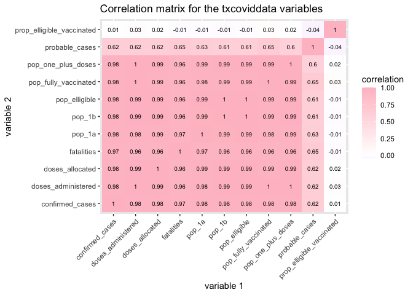

Analyzing Covid-19 Vaccinations in Texas Counties Compared to Overall
Cases
================
Ashley Gilliam
3/11/2021

## Introduction

In this project, I will be analyzing the relationships between Covid-19
Vaccine administrations and Covid-19 cases among counties in the state
of Texas. The datasets I am using were acquired from the Texas
Department of State and Health Services website. The first dataset,
txcases, consists of the counties in Texas and their respective
confirmed cases, probable cases, and fatalities. The second dataset,
txvaccines, includes the counties, their public health region labels,
how many doses they have been allocated, how many doses have been
administered, the total population that has received at least one dose,
the population that has received two doses, and then the populations of
high-risk groups that have been given elligibility for the vaccine
through Texas’ Phase 1a and Phase 1b plans. I chose these datasets
because I am keenly interested in the current pandemic and the rate at
which we are able to vaccinate our citizens. I expect to see that the
number of vaccines administered is directly correlated to the number of
confirmed cases. This is because counties with higher case numbers will
likely be allocated more vaccine doses in order to lessen the infection
and death rates by innoculating high-risk groups. Through this project,
I will be able to analyze the data and confirm whether or not my
hypothesis is true. The first thing I need to do is tidy the datasets in
order to make them more functional in R.

## Tidying Datasets

``` r
library(readxl)
library(tidyverse)
```

    ## ── Attaching packages ─────────────────────────────────────── tidyverse 1.3.0 ──

    ## ✓ ggplot2 3.3.3     ✓ purrr   0.3.4
    ## ✓ tibble  3.0.5     ✓ dplyr   1.0.3
    ## ✓ tidyr   1.1.2     ✓ stringr 1.4.0
    ## ✓ readr   1.4.0     ✓ forcats 0.5.0

    ## ── Conflicts ────────────────────────────────────────── tidyverse_conflicts() ──
    ## x dplyr::filter() masks stats::filter()
    ## x dplyr::lag()    masks stats::lag()

``` r
#First, I need to import the datasets
txcases <- read_excel("CaseCountData (3).xlsx")
txvaccines <- read_excel("COVID-19 Vaccine Data by County (1).xlsx", sheet = "By County")
#I will be removing all the spaces from the column names to make them easier to work with
txcases_clean <- txcases %>%
  select_all(~gsub("\\s+|\\.", "_", .)) %>% 
  #I then make all the variables lowercase
  select_all(tolower)
#Repeat the steps for the second dataset
txvaccines_clean <- txvaccines %>%
  #remove spaces from variable names and replace with underscores
  select_all(~gsub("\\s+|\\.", "_", .)) %>%
  #remove + symbols from variable names
  select_all(~gsub("\\+","", .)) %>%
  #remove , from variable names
  select_all(~gsub("\\,","", .)) %>%
  #remove - from variable names
  select_all(~gsub("\\-","", .)) %>%
  #remove parentheses from variable
  select_all(~gsub("\\(","", .)) %>%
  select_all(~gsub("\\)","", .)) %>%
  #make all variables lowercase
  select_all(tolower) %>%
  #lastly, I will be renaming the variables too shorten them for ease
  rename("county" = county_name, "phr" = public_health_region_phr, "doses_allocated" = total_doses_allocated, "doses_administered" = vaccine_doses_administered, "pop_one_plus_doses" = people_vaccinated_with_at_least_one_dose, "pop_fully_vaccinated" = people_fully_vaccinated, "pop_16" = population_16, "pop_65" = population_65, "pop_healthcare" = population_phase_1a_healthcare_workers, "pop_ltcr" = population_phase_1a_longterm_care_residents, "pop_condition" = population_1664_any_medical_condition, "pop_education" = population_education_and_child_care_personnel)
```

Now that the datasets have been tidied, I will use an inner join to
combine the two datasets. I have chosen to perform an inner join because
I would only like to consider the counties in Texas, not the Unknown
observations from the txcases dataset nor the Pharmacy and Long-Term
Care Facility observations in the txvaccines dataset. Thus, the inner
join function is ideal as it will keep all of the common counties
between the two datasets and exclude these observations that don’t
convey observations for a specific county in Texas. A potential issue
that arises as a result of excluding the Federal Long-Term Care
Vaccination Program and Federal Pharmacy Retail Vaccination Program
observations from the joined dataset is that the data will lack the
doses allocated and administered to people via those programs. However,
the dataset seems to lack measurements for these observations except for
the number of doses allocated, so I do not think it will impact our
analysis much.

## Joining Datasets

``` r
#use inner_join to combine datasets
txcoviddata <- txcases_clean %>%
  inner_join(txvaccines_clean, by = c("county")) %>%
  #make all the numeric variables numeric class
  mutate_at(2:15, as.numeric)
```

    ## Warning: Problem with `mutate()` input `phr`.
    ## ℹ NAs introduced by coercion
    ## ℹ Input `phr` is `.Primitive("as.double")(phr)`.

``` r
#view new dataset
txcoviddata
```

    ## # A tibble: 254 x 15
    ##    county confirmed_cases probable_cases fatalities   phr doses_allocated
    ##    <chr>            <dbl>          <dbl>      <dbl> <dbl>           <dbl>
    ##  1 Ander…            4809           1268        110    NA            9800
    ##  2 Andre…            1701              0         46    NA            3300
    ##  3 Angel…            4697           3339        265    NA           28300
    ##  4 Arans…             879            277         35    11            2300
    ##  5 Archer             678            101         12    NA            1600
    ##  6 Armst…             107             42          6     1            1100
    ##  7 Atasc…            4086           1357        141     8            8100
    ##  8 Austin            1593            310         32    NA            3900
    ##  9 Bailey             585            217         17     1           14545
    ## 10 Bande…             922            368         26     8            1300
    ## # … with 244 more rows, and 9 more variables: doses_administered <dbl>,
    ## #   pop_one_plus_doses <dbl>, pop_fully_vaccinated <dbl>, pop_16 <dbl>,
    ## #   pop_65 <dbl>, pop_healthcare <dbl>, pop_ltcr <dbl>, pop_condition <dbl>,
    ## #   pop_education <dbl>

## Summary Statistics

``` r
txcoviddata2 <-  txcoviddata %>%
  #create variable representing total population that falls under phase 1a elligibility
  mutate("pop_1a" = (pop_healthcare + pop_ltcr)) %>%
  #create variable representing total population that falls under phase 1b elligibility
  mutate("pop_1b" = (pop_condition + pop_education + pop_65)) %>%
  #create variable representing total population eligible for vaccine
   mutate("pop_elligible" = (pop_1a + pop_1b)) %>%
  #create variable representing proportion of eligible population vaccinated
  mutate("prop_elligible_vaccinated" = (pop_one_plus_doses/pop_elligible)) %>%
  #create categorical variable indicating if the county has a high, medium, or low level of cases
  mutate(case_level = case_when(confirmed_cases>10000 ~ "high", 
                                  1000<=confirmed_cases & confirmed_cases<=10000 ~ "med",
                                  confirmed_cases<1000 ~ "low"))
txcoviddata2 %>%
  #select against the variables that comprise pop_1a and pop_1b as well as the public health region variable
  select(-c("pop_16", "pop_65", "pop_healthcare", "pop_ltcr", "pop_condition", "pop_education", "phr" )) %>%
  #group by case_level
  group_by(case_level) %>%
  #arrange in descending order of confirmed cases
  arrange(desc(confirmed_cases))
```

    ## # A tibble: 254 x 13
    ## # Groups:   case_level [3]
    ##    county confirmed_cases probable_cases fatalities doses_allocated
    ##    <chr>            <dbl>          <dbl>      <dbl>           <dbl>
    ##  1 Harris          360421              0       5370         1423180
    ##  2 Dallas          248225          36710       3613          860935
    ##  3 Tarra…          208299          37330       2727          665690
    ##  4 Bexar           169419          29550       3071          672940
    ##  5 El Pa…          125985              0       2422          301620
    ##  6 Travis           76855              0        892          455450
    ##  7 Collin           70835          13754        754          309090
    ##  8 Fort …           52114           7707        588          235360
    ##  9 Hidal…           51784          26135       2361          288950
    ## 10 Denton           51108          17128        685          270790
    ## # … with 244 more rows, and 8 more variables: doses_administered <dbl>,
    ## #   pop_one_plus_doses <dbl>, pop_fully_vaccinated <dbl>, pop_1a <dbl>,
    ## #   pop_1b <dbl>, pop_elligible <dbl>, prop_elligible_vaccinated <dbl>,
    ## #   case_level <chr>

``` r
txcoviddata2 %>%
  summarize(mean_cases = mean(confirmed_cases), 
            sd_cases = sd(confirmed_cases),
            mean_doses = mean(doses_administered),
            mean_prop = mean(prop_elligible_vaccinated),
            mean_pop_elligible = mean(pop_elligible))
```

    ## # A tibble: 1 x 5
    ##   mean_cases sd_cases mean_doses mean_prop mean_pop_elligible
    ##        <dbl>    <dbl>      <dbl>     <dbl>              <dbl>
    ## 1      9174.   34063.     26902.     0.309             56699.

``` r
txcoviddata2 %>%
  group_by(case_level) %>%
  summarize(mean_cases = mean(confirmed_cases), 
            sd_cases = sd(confirmed_cases),
            mean_doses = mean(doses_administered),
            mean_prop = mean(prop_elligible_vaccinated),
            mean_pop_elligible = mean(pop_elligible))
```

    ## # A tibble: 3 x 6
    ##   case_level mean_cases sd_cases mean_doses mean_prop mean_pop_elligible
    ## * <chr>           <dbl>    <dbl>      <dbl>     <dbl>              <dbl>
    ## 1 high           56244.   77245.    160379.     0.315            326685.
    ## 2 low              404.     288.      1922.     0.342              4155.
    ## 3 med             2957.    1873.      9390.     0.273             23386.

``` r
txcoviddata2_num <- txcoviddata2 %>%
  select_if(is.numeric) %>%
  select(-c("pop_16", "pop_65", "pop_healthcare", "pop_ltcr", "pop_condition", "pop_education", "phr" ))
cor(txcoviddata2_num, use = "pairwise.complete.obs")
```

    ##                           confirmed_cases probable_cases  fatalities
    ## confirmed_cases               1.000000000     0.62425131  0.96729797
    ## probable_cases                0.624251308     1.00000000  0.65234464
    ## fatalities                    0.967297968     0.65234464  1.00000000
    ## doses_allocated               0.982499799     0.62325459  0.95552808
    ## doses_administered            0.983623503     0.61592184  0.95746919
    ## pop_one_plus_doses            0.982577299     0.59660158  0.95588580
    ## pop_fully_vaccinated          0.983046659     0.65188751  0.95765654
    ## pop_1a                        0.976868304     0.62779004  0.97109375
    ## pop_1b                        0.982126186     0.60599670  0.95896473
    ## pop_elligible                 0.982462531     0.60904128  0.96124923
    ## prop_elligible_vaccinated     0.009760489    -0.04198885 -0.01392605
    ##                           doses_allocated doses_administered pop_one_plus_doses
    ## confirmed_cases                0.98249980         0.98362350         0.98257730
    ## probable_cases                 0.62325459         0.61592184         0.59660158
    ## fatalities                     0.95552808         0.95746919         0.95588580
    ## doses_allocated                1.00000000         0.99355141         0.99388818
    ## doses_administered             0.99355141         1.00000000         0.99935562
    ## pop_one_plus_doses             0.99388818         0.99935562         1.00000000
    ## pop_fully_vaccinated           0.99003561         0.99791804         0.99499600
    ## pop_1a                         0.98890924         0.98493693         0.98638366
    ## pop_1b                         0.99301097         0.99388981         0.99496706
    ## pop_elligible                  0.99348865         0.99381863         0.99493877
    ## prop_elligible_vaccinated      0.01824685         0.02547401         0.02351734
    ##                           pop_fully_vaccinated       pop_1a      pop_1b
    ## confirmed_cases                     0.98304666  0.976868304  0.98212619
    ## probable_cases                      0.65188751  0.627790038  0.60599670
    ## fatalities                          0.95765654  0.971093749  0.95896473
    ## doses_allocated                     0.99003561  0.988909239  0.99301097
    ## doses_administered                  0.99791804  0.984936933  0.99388981
    ## pop_one_plus_doses                  0.99499600  0.986383661  0.99496706
    ## pop_fully_vaccinated                1.00000000  0.980010312  0.98876535
    ## pop_1a                              0.98001031  1.000000000  0.99055935
    ## pop_1b                              0.98876535  0.990559346  1.00000000
    ## pop_elligible                       0.98871173  0.992569210  0.99987935
    ## prop_elligible_vaccinated           0.02865568 -0.007739243 -0.01297198
    ##                           pop_elligible prop_elligible_vaccinated
    ## confirmed_cases              0.98246253               0.009760489
    ## probable_cases               0.60904128              -0.041988851
    ## fatalities                   0.96124923              -0.013926047
    ## doses_allocated              0.99348865               0.018246846
    ## doses_administered           0.99381863               0.025474012
    ## pop_one_plus_doses           0.99493877               0.023517344
    ## pop_fully_vaccinated         0.98871173               0.028655678
    ## pop_1a                       0.99256921              -0.007739243
    ## pop_1b                       0.99987935              -0.012971981
    ## pop_elligible                1.00000000              -0.012391362
    ## prop_elligible_vaccinated   -0.01239136               1.000000000

Using the mutate function, I created two new variables: pop\_1a and
pop\_1b. pop\_1a represents the total population of county citizens that
are eligible for the vaccine under the conditions of Phase 1a, meaning
that they are healthcare workers or long-term care residents and
employees. pop\_1b represents the total population of each county that
is eligible for the Covid-19 vaccine based on Phase 1b. This means that
they are either aged 65 or older, aged 16-64 with a medical condition
that puts them at high risk of a severe Covid-19 case, or an
education/child-care employee. I then combined the two variables to
create a variable adding up the total known population of individuals
eligible for the vaccine. Using this new variable, pop\_elligible, I
created a proportion of the eligible population that has been
vaccinated. This is under the assumptions that a) only those who are
truly eligible for the vaccine are being vaccinated, and b) the total
doses administered per county have been administered to county citizens
and not those living in other areas. Lastly, I created a variable called
case\_level which divided the counties into high, medium, or low
depending on how many total covid cases they have.

I calculated the average number of cases, vaccine doses administered,
eligible population, and proportion of the eligible population that has
been vaccinated both overall and when the dataset has been grouped based
by case level. Altogether, the average number of covid cases across the
counties in Texas is 9174.08 cases with a standard deviation of 34062.57
cases. The mean number of doses administered is 26902.38 doses. The mean
eligible population is 56699.36 people with an average proportion of
vaccinated population of 0.31.

When grouped by case level, those in the “high” case level had the
largest average number of Covid-19 cases, 56,244.31 cases, and the
largest average number of doses distributed, 160,378.71 doses. The
average eligible population was also the highest with 326,685.11
individuals. The higher average number of cases, doses administered, and
eligible population are expected as we would likely see these larger
numbers in a more densely populated county. Counties with higher numbers
of cases will also see larger numbers of doses being distributed to
them, as they are at a higher risk level overall than less populated
counties. Larger counties will also have greater access to resources
that allow for them to store the vaccines that require specific, low
temperatures such as -80 degree Celsius freezers. Each of these factors
diminishes as we look at smaller counties. Rural areas, where the less
populated counties often are located, often do not possess the resources
or manpower to maintain a vaccine stock as grand as the larger counties.

Lastly, I calculated a correlation matrix for the dataset which will be
visualized in the next section.

## Visualizations

``` r
#visualize the correlation matrix usiing a heatmap
cor(txcoviddata2_num, use = "pairwise.complete.obs") %>%
  #save as a data frame
  as.data.frame %>%
  #convert row names to an explicit variable
  rownames_to_column %>%
  #pivot so that all correlations appear in the same column
  pivot_longer(-1, names_to = "other_var", values_to = "correlation") %>%
  ggplot(aes(rowname, other_var, fill=correlation)) +
  #heatmap with geom_tile
  geom_tile() +
  #apply color gradient for scale
  scale_fill_gradient2(low="purple",mid="white",high="pink") +
  #overlay values
  geom_text(aes(label = round(correlation,2)), color = "black", size = 2.5) +
  #add title and axis labels
  labs(title = "Correlation matrix for the txcoviddata variables", x = "variable 1", y = "variable 2") +
  #rotate x-axis variables at an angle so they are easier to read
  theme(axis.text.x = element_text(angle=45, hjust=1)) 
```

<!-- -->

``` r
txcoviddata2 %>%
  #make plot for confirmed cases vs. doses administered
  ggplot(aes(x=confirmed_cases, y=doses_administered)) +
  #make plot a scatterplot and color by case_level
  geom_point(aes(color = case_level)) +
  #change colors of data points
  scale_color_brewer(palette="Set2") +
  #wrap based on case_level and adjust scales accordingly
  facet_wrap(. ~ case_level, scales= "free") +
  #remove legend
  theme(legend.position="none") +
  #add axis labels and title
  labs(x= "Confirmed Cases", y= "Vaccine Doses Administered", title = "Vaccine Doses Adminstered vs. Confirmed Covid Cases")
```

<!-- -->

``` r
txcoviddata2 %>%
   #make plot for proportion of those vaccinated vs. case level
  ggplot(aes(x=case_level, y=prop_elligible_vaccinated, fill=case_level)) +
  #make plot a bargraph
  geom_bar(stat="summary", fun="mean") +  
  #change colors of bars
  scale_fill_brewer(palette="Set2") +
  #remove legend
  theme(axis.text.x = element_text(angle=45, hjust=1), legend.position="none") +
  #add axis labels and title
  labs(x= "Case Level", y= "Mean Proportion of Eligible Population Vaccinated", title = "Proportion of Eligible Populations Vaccinated Based on Case Level Severity") 
```

<!-- -->

I first visualized the correlation matrix I calculated in the Summary
Statistics section with a heatmap. According to the plot, there is a
strong, positive correlation between most of the variables. The
exception is the probable cases variable, which has a weaker positive
correlation between the rest of the variables. This could be explained
by the fact that probable cases are much more hypothetical than
confirmed cases. They are cases that may be suspected to be Covid-19, so
they are much more variable and often times lower than the number of
verified, confirmed cases. Additionally, the proportion variable that I
created does not have a correlation between between any of the other
variables. This indicates that the rate at which the counties can
vaccinate their populations may not differ based on their overall case
level and size.

I investigated this last detail further bycreating a barplot to
visualize the mean proportion of vaccinated population for each case
level group. The “high” case level had an average proportion of around
30%, the “medium” level had a mean proportion of about 35%, and the
“low” case level had an average proportion of around 27%. This comes
as a surprise to me, as I expected the high case level group to have the
greatest proportion, as they have the highest number of vaccines
allocated to them. However, they have a much larger population to
vaccinate, which would explain why they have a slightly lower proportion
than those sorted into the low case level. This would also explain why a
correlation isn’t demonstrated between the proportion variable and the
other dataset variables. The size of eligible population and the number
of doses allocated and administered do not have an impact on the overall
proportion of vaccinated population.

My third plot is a scatterplot of the total vaccine doses administered
compared to the total number of confirmed cases by each county. I
faceted the plots by case\_level as to give a better scale for each of
the category groups. As demonstrated by the plots, there is a positive,
linear relationship between counties that have higher case numbers and
the number of doses administered. This was expected, as we would likely
see a higher number of doses allocated towards those counties that are
suffering the most from the pandemic. Those in the high case level group
appear to have the steepest, positive linear correlation.

## PCA Analysis

``` r
library(ggrepel)
options(ggrepel.max.overlaps = Inf)
covid_pca <- txcoviddata2_num %>%
  #scale numeric variables
  mutate_if(is.numeric,scale) %>%
  prcomp

#calculate explained variance
percent <- 100* (covid_pca$sdev^2 / sum(covid_pca$sdev^2))
percent
```

    ##  [1] 8.442749e+01 9.160064e+00 5.282131e+00 6.002390e-01 2.471442e-01
    ##  [6] 1.530600e-01 7.130438e-02 4.714511e-02 1.138347e-02 3.478730e-05
    ## [11] 3.121653e-31

``` r
library(factoextra)
```

    ## Welcome! Want to learn more? See two factoextra-related books at https://goo.gl/ve3WBa

``` r
#create scree plot
fviz_screeplot(covid_pca,
               #change bar colors
               barfill="pink",
               barcolor="pink") +
  #add text labels
  geom_text(aes(label = round(percent[1:10], 2)), size = 4, vjust = -0.5)
```

<!-- -->

``` r
#calculate eigen values for PCs
txcoviddata2_num %>%
  cor %>%
  eigen()
```

    ## eigen() decomposition
    ## $values
    ##  [1] 9.287024e+00 1.007607e+00 5.810344e-01 6.602629e-02 2.718586e-02
    ##  [6] 1.683660e-02 7.843482e-03 5.185962e-03 1.252181e-03 3.826603e-06
    ## [11] 4.602438e-17
    ## 
    ## $vectors
    ##               [,1]         [,2]         [,3]        [,4]        [,5]
    ##  [1,] -0.324322802  0.010233613 -0.064820009  0.15769629  0.67903107
    ##  [2,] -0.219978863 -0.104310249  0.963291093 -0.08057697 -0.02379651
    ##  [3,] -0.319512132 -0.019166652  0.004164547  0.86689980 -0.01820284
    ##  [4,] -0.326081693  0.019556166 -0.074893252 -0.19399951 -0.11516530
    ##  [5,] -0.326387306  0.027847173 -0.087170817 -0.20759661  0.13778682
    ##  [6,] -0.325875377  0.027834090 -0.120001521 -0.20105624  0.04881385
    ##  [7,] -0.326417495  0.027195975 -0.022819386 -0.21504812  0.29277213
    ##  [8,] -0.325487081 -0.007857076 -0.067412747  0.12397098 -0.56369232
    ##  [9,] -0.326061516 -0.009759573 -0.111221192 -0.14396433 -0.20093128
    ## [10,] -0.326305887 -0.009553260 -0.106362742 -0.11374077 -0.24222704
    ## [11,] -0.001202975  0.992837736  0.107213755  0.02628698 -0.02960179
    ##              [,6]         [,7]         [,8]         [,9]         [,10]
    ##  [1,]  0.60914487 -0.045839129 -0.171002571 -0.045267303  1.036012e-02
    ##  [2,]  0.02935639 -0.032606838  0.006738913 -0.061337964  2.694035e-03
    ##  [3,] -0.31322911  0.006193805  0.217208147 -0.017501785 -6.645220e-03
    ##  [4,]  0.21759493  0.660656119  0.589075998  0.076928920 -6.146419e-03
    ##  [5,] -0.34209254  0.041467416 -0.120989395 -0.190108798  8.083866e-01
    ##  [6,] -0.26350436  0.046719261 -0.121556483 -0.704438817 -5.031863e-01
    ##  [7,] -0.44231420  0.059458425 -0.190397440  0.657351726 -3.044510e-01
    ##  [8,]  0.26184785  0.243075761 -0.640635491  0.104252465  1.647544e-02
    ##  [9,]  0.11706764 -0.538582936  0.269511305  0.077844413 -1.021554e-02
    ## [10,]  0.13358403 -0.450523041  0.166636836  0.080910635 -7.200837e-03
    ## [11,]  0.02007929 -0.027653986  0.006260223  0.001612627 -9.761955e-05
    ##               [,11]
    ##  [1,]  0.000000e+00
    ##  [2,]  1.861961e-15
    ##  [3,]  2.179226e-15
    ##  [4,] -4.242520e-15
    ##  [5,] -2.495537e-13
    ##  [6,]  1.949114e-13
    ##  [7,]  6.501763e-14
    ##  [8,] -8.444019e-02
    ##  [9,] -6.614700e-01
    ## [10,]  7.452029e-01
    ## [11,] -5.060525e-18

``` r
# save the rotation matrix as a data frame
rotation_data <- data.frame(
  covid_pca$rotation, 
  variable = row.names(covid_pca$rotation))

#define an arrow style
arrow_style <- arrow(length = unit(0.05, "inches"), type = "closed")

#plot the contribution of variables to PCs
ggplot(rotation_data) + 
  #add arrows with geom_segment
  geom_segment(aes(xend = PC1, yend = PC2), x = 0, y = 0, arrow = arrow_style) + 
  #add text labels with geom_text_repel
  geom_text_repel(aes(x = PC1, y = PC2, label = variable), hjust = 0, size = 3, color = "purple") + 
  xlim(-1., 1.25) + 
  ylim(-1., 1.) +
  coord_fixed()
```

<!-- -->

``` r
#save the x matrix as a data frame
#add county and case_level columns
x_data <- data.frame(county = txcoviddata2$county, case_level = txcoviddata2$case_level,
  covid_pca$x)

#create plot
x_data %>%
  #plot along PC1 and PC2 with color by case_level
  ggplot(aes(x = PC1, y = PC2, color = case_level)) + 
  #make scatterplot
  geom_point() +
  #change colors of points based on case level
  scale_color_brewer(palette="Set2") +
  #add labels
  labs(title = "Observations along PC1 and PC2")
```

<!-- -->

To finish things off, I used PCA to analyze the data. I first selected
for only numeric variables and scaled them. In order to determine how
many PC variables to analyze, I created a scree plot as well as
calculated eigen values. Kaiser’s rule states that we should keep PC’s
that have a calculated eigenvalue greater than one, while we find the
“elbow” of a scree plot to determine how many PC’s to keep. Based on
solely the scree plot, I would say that the elbow is around PC2 or PC3.
The calculated eigenvalue for PC3, however, is around 0.5, so I will
only take PC1 and PC2 into consideration. I also calculated the
percentage of variance explained by these variables. PC1 explains 84.43%
of the variance among the variables whereas PC2 covers 9.16% of the
variance between the variables. I visualiazed what variables influenced
which PC’s by using geom\_segment and geom\_text. As demonstrated by the
plot, the variable of the proportion of eligible population vaccinated
greatly influenced PC2 while all of the remaining variables influenced
PC1. Since many of the arrows were close together, I tried to space out
the variable labels better using the package “ggrepel.” It appears that
PC2 is most influenced by the variable prop\_elligible\_vaccinated while
PC1 is impacted by the remaining numeric variables. Lastly, I visualized
each of the observations along PC1 and PC2 and grouped them based on
their case level. Those observations in the “low” case level appears to
be greatly varied along the PC2. The “high” and “medium” case level
groups appear to be more negatively influenced by PC2. This could be
explained by the fact that the variable of the proportion of those
vaccinated doesn’t correlate much to any other variables. Neither case
level appears to be influenced much by PC1. Alternatively, those
observations in the “high” case level seem more positively affected by
PC1 than the other two case level groups.

## References

<div id="refs" class="references">

<div id="ref-R-purrr">

Henry, Lionel, and Hadley Wickham. 2020. *Purrr: Functional Programming
Tools*. <https://CRAN.R-project.org/package=purrr>.

</div>

<div id="ref-R-factoextra">

Kassambara, Alboukadel, and Fabian Mundt. 2020. *Factoextra: Extract and
Visualize the Results of Multivariate Data Analyses*.
<http://www.sthda.com/english/rpkgs/factoextra>.

</div>

<div id="ref-R-tibble">

Müller, Kirill, and Hadley Wickham. 2021. *Tibble: Simple Data Frames*.
<https://CRAN.R-project.org/package=tibble>.

</div>

<div id="ref-R-base">

R Core Team. 2020. *R: A Language and Environment for Statistical
Computing*. Vienna, Austria: R Foundation for Statistical Computing.
<https://www.R-project.org/>.

</div>

<div id="ref-R-ggrepel">

Slowikowski, Kamil. 2021. *Ggrepel: Automatically Position
Non-Overlapping Text Labels with Ggplot2*.
<https://github.com/slowkow/ggrepel>.

</div>

<div id="ref-ggplot22016">

Wickham, Hadley. 2016. *Ggplot2: Elegant Graphics for Data Analysis*.
Springer-Verlag New York. <https://ggplot2.tidyverse.org>.

</div>

<div id="ref-R-stringr">

———. 2019a. *Stringr: Simple, Consistent Wrappers for Common String
Operations*. <https://CRAN.R-project.org/package=stringr>.

</div>

<div id="ref-R-tidyverse">

———. 2019b. *Tidyverse: Easily Install and Load the Tidyverse*.
<https://CRAN.R-project.org/package=tidyverse>.

</div>

<div id="ref-R-forcats">

———. 2020a. *Forcats: Tools for Working with Categorical Variables
(Factors)*. <https://CRAN.R-project.org/package=forcats>.

</div>

<div id="ref-R-tidyr">

———. 2020b. *Tidyr: Tidy Messy Data*.
<https://CRAN.R-project.org/package=tidyr>.

</div>

<div id="ref-tidyverse2019">

Wickham, Hadley, Mara Averick, Jennifer Bryan, Winston Chang, Lucy
D’Agostino McGowan, Romain François, Garrett Grolemund, et al. 2019.
“Welcome to the tidyverse.” *Journal of Open Source Software* 4 (43):
1686. <https://doi.org/10.21105/joss.01686>.

</div>

<div id="ref-R-readxl">

Wickham, Hadley, and Jennifer Bryan. 2019. *Readxl: Read Excel Files*.
<https://CRAN.R-project.org/package=readxl>.

</div>

<div id="ref-R-ggplot2">

Wickham, Hadley, Winston Chang, Lionel Henry, Thomas Lin Pedersen,
Kohske Takahashi, Claus Wilke, Kara Woo, Hiroaki Yutani, and Dewey
Dunnington. 2020. *Ggplot2: Create Elegant Data Visualisations Using the
Grammar of Graphics*. <https://CRAN.R-project.org/package=ggplot2>.

</div>

<div id="ref-R-dplyr">

Wickham, Hadley, Romain François, Lionel Henry, and Kirill Müller. 2021.
*Dplyr: A Grammar of Data Manipulation*.
<https://CRAN.R-project.org/package=dplyr>.

</div>

<div id="ref-R-readr">

Wickham, Hadley, and Jim Hester. 2020. *Readr: Read Rectangular Text
Data*. <https://CRAN.R-project.org/package=readr>.

</div>

</div>
